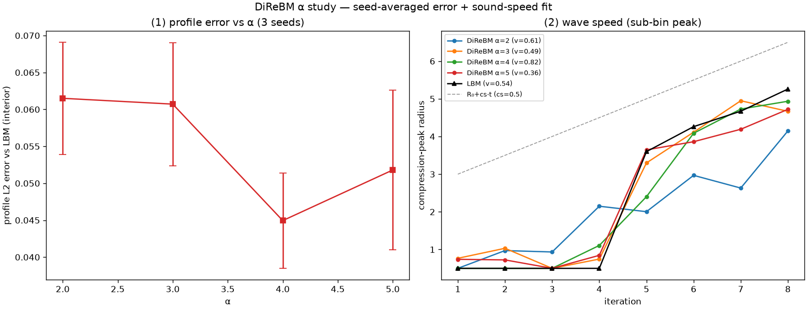

# exp_alpha_robust — seed-averaged α error + sound-speed fit (v1)

Date: 2026-06-26 · Code: `experiments/exp_alpha_robust.py` · Baseline: `direbm.lbm.HexLBM`

Robust follow-up to `exp_convergence` (whose single-run α curve was noisy). DiReBM is
deterministic, so an ensemble is built by jittering the moment lattice by a random sub-cell offset
per seed (3 seeds) — independent field-reconstruction realizations. From the same runs we get the
profile error (mean ± std) and the compression-peak trajectory (sub-bin, parabolic), whose slope
over the propagation phase (iters 5–8, after the peak detaches from the centre) is the wave speed.
HALF=10, STEPS=8, τ=0.6, pulse disk ρ=1.5 on a rest background.

## Result



```
 alpha   L2_err (mean +/- std)   speed
   2.0     0.0615 +/- 0.0076     0.61
   3.0     0.0607 +/- 0.0083     0.49
   4.0     0.0449 +/- 0.0065     0.82
   5.0     0.0518 +/- 0.0108     0.36
 LBM speed = 0.539   (lattice cs = 0.5)
```

### Sound speed

- **LBM peak speed = 0.54 ≈ cs = 0.5** — the metric correctly recovers the lattice sound speed, so
  the comparison is meaningful.
- In the propagation phase the **DiReBM (α=3,4) peak overlaps the LBM peak** (panel 2); the wave
  travels at ≈ cs. α=2 visibly **lags** (slower, less accurate).
- The per-α DiReBM speed *fits* are noisy (0.36–0.82) — 1-cell radial bins over only 4 fit points.
  They bracket cs but cannot resolve an α-dependence of the speed. A finer-bin / longer-run fit is
  the follow-up.

### Profile error vs α

- Seed-averaged error bars **overlap**: α=4 is a mild optimum (0.045), the others ~0.05–0.06.
- This **tempers `exp_convergence`**: that single run showed a sharp α=2 penalty (0.115) and an
  α=5 uptick. With averaging + more steps, α=2's penalty largely disappears by iter 8 and the α=5
  "uptick" is within noise. Real signal: **α≈4 is mildly best; accuracy is fairly insensitive to α
  for α ≥ 3.**

## Takeaways

- DiReBM's acoustic wave speed matches LBM (≈ cs) for α ≥ 3; α=2 lags.
- α ≈ 4 is the practical sweet spot (mild accuracy optimum, moderate cost). Consistent with the
  thesis.
- Caveats unchanged: LBM is a proxy, not ground truth (see `exp_lbm_vs_drbm.md`); the DiReBM speed
  fit is bin/length-limited; 3 seeds is a small ensemble.
