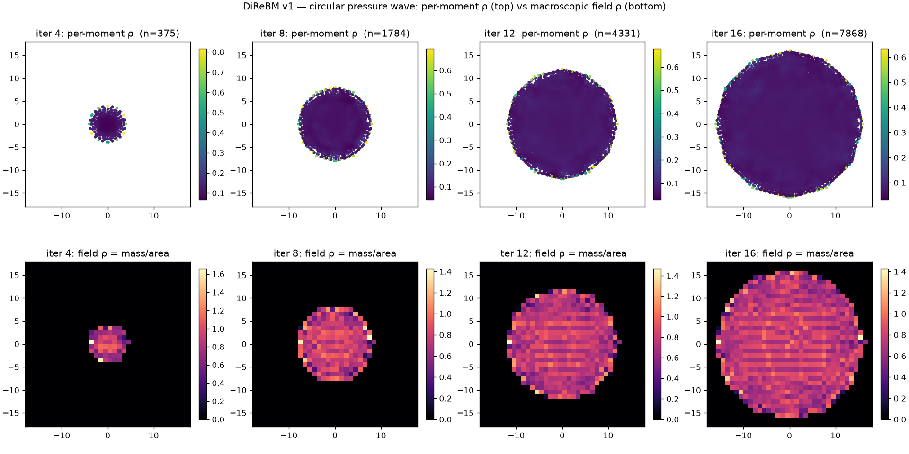

# exp_circular_wave — pressure pulse from rest (v1 reference)

Date: 2026-06-26 · Code: `experiments/exp_circular_wave.py` · Solver: `direbm.reference.Simulator`

## Setup

Single elevated-density moment (ρ=1.5, u=0) at the origin; everywhere else implicit rest. τ=0.6,
α=4, κ_hard=4, κ_soft=5 (lattice units). Run 16 iterations; snapshot moment positions + density
at iterations 4/8/12/16. This is the thesis demo (§5.2).

## Result



```
 iter  #moments   max_r  total_mass
    1         7    1.00       4.500
    4       375    4.00      47.259
    8      1784    8.00     165.114
   12      4331   12.00     347.656
   16      7868   16.00     602.976
```

- **Front radius = iteration exactly** — unit dispersion per step, as designed.
- **Isotropic / circular** spread, not hexagonal → the soft-outer correction (eq 4.3) works.
- **Stable**, all-finite, ρ>0 throughout.
- Two views (figure): *top* = per-moment ρ; *bottom* = reconstructed macroscopic field ρ
  (`bin_fields`, mass/area). The field view shows the physically correct picture: a disk at
  ≈ρ_rest with a **compression ring at the front**, vacuum outside. The top view looks
  "rarefied" only because per-moment ρ tracks 1/(sample-point density) — see below.

## Note on reading density (resolved)

An earlier draft of this writeup flagged the interior density as "decaying far below rest"
(per-moment ρ ≈ 0.08 by it16) and suspected the resampling rest-fill (eq 4.7). That was a
**measurement error**: a moment's ρ = Σ f_i is the mass of one sample point, which scales as
1/(local point density), not the macroscopic density. The macroscopic density is **mass per
area** (`direbm.bin_fields`). Reconstructed that way the field sits at ≈ρ_rest (bottom row), and
`exp_rest_state` confirms a uniform rest field is preserved (ρ_field ≈ 1.00, |u_field| ≈ 0). So
density is **not** broken.

## Real open signal

The number of moments inflates each step (point density climbs toward the α-set saturation,
~1/(dx/α)² per area). This is an efficiency/sampling concern, not a correctness one — characterized
in `exp_rest_state` and tracked for the improvement list (adaptive down-sampling of featureless
regions). Next quantitative step: an LBM baseline to compare wave speed and profile.

## Status

v1 reference solver runs end to end (collision + dispersion + create/refine control points +
resampling), reproduces the thesis demo, and preserves the macroscopic density field. Correctness
anchor established; LBM-baseline comparison is the next validation step.
