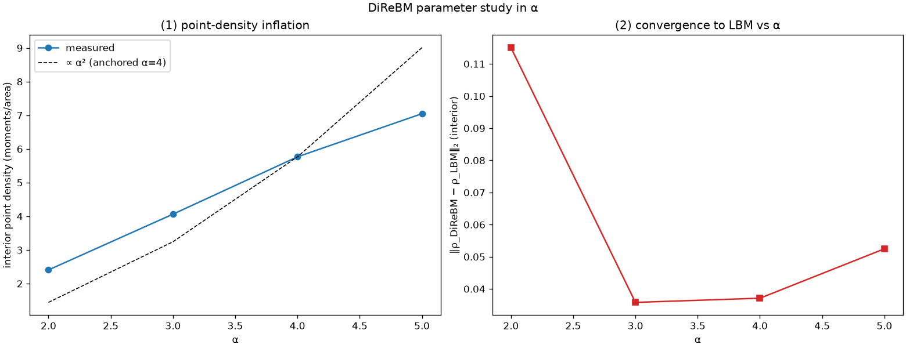

# exp_convergence — parameter study in α (v1)

Date: 2026-06-26 · Code: `experiments/exp_convergence.py` · Baseline: `direbm.lbm.HexLBM`

α is the control-point density factor: the creation threshold radius is dx/α, so larger α → more
control points → finer sampling, more compute. This study quantifies the cost (point-density
inflation) and the benefit (agreement with the LBM macroscopic wave), and checks stability.

## Result



### (1) Point-density inflation

Interior sample-point density (moments/area) after 5 rest-field steps:

```
 alpha   density (moments/area)
   2.0      2.41
   3.0      4.06
   4.0      5.77
   5.0      7.05
```

Monotonic in α, growing roughly between linear and quadratic at this step count (the theoretical
cap is ~α², from the dx/α minimum spacing; the field is still filling toward it). **Compute cost
grows with α** — the price of precision. The density is bounded (the threshold caps it), but in a
featureless region it inflates regardless of need → motivates adaptive (local) α as an
improvement.

### (2) Convergence to LBM + stability

L2 distance between the DiReBM and LBM interior radial density profiles (pulse-on-rest, 6 steps):

```
 alpha   profile_L2_err   stable
   2.0       0.1151         yes
   3.0       0.0358         yes
   4.0       0.0371         yes
   5.0       0.0525         yes
```

- **U-shaped**: best agreement at **α ≈ 3–4** (err ≈ 0.037), markedly worse at α=2 (0.115).
- **No blow-up** (all finite over 6 steps). The thesis reported instability worsening as α
  decreases; here that shows up as **accuracy degradation at small α** (α=2) rather than a hard NaN
  in a short run.
- The slight uptick at α=5 is small and may be within single-run reconstruction noise; a
  seed-averaged study would confirm whether α=4 is a genuine optimum.

> **Refined by `exp_alpha_robust.md`** (seed-averaged, 8 steps): the error bars overlap — the sharp
> α=2 penalty seen here is partly a short-run transient (it relaxes by iter 8), and the α=5 uptick
> is within noise. Robust signal: **α≈4 is a mild optimum; accuracy is fairly insensitive to α for
> α ≥ 3.** That study also fits the wave speed: LBM ≈ 0.54 ≈ cs, with DiReBM (α≥3) tracking it.

## Takeaways

- **α ≈ 3–4 is the sweet spot** for this case: good LBM agreement at moderate cost. Consistent
  with the thesis's α=4 choice.
- Point density (hence cost) rises with α faster than accuracy improves past α≈4 → diminishing
  returns; reinforces the case for **adaptive local α** (refine only where the field has structure).

## Limits / follow-ups

> Note: "convergence to LBM" here means convergence to the LBM *result*, which is itself only a
> proxy — LBM is not ground truth (compressibility / lattice / BGK errors). See the "LBM is not
> ground truth" note in `exp_lbm_vs_drbm.md`. A true-accuracy study needs a real reference.


Single run per α, one IC, 1-cell bins, 5–6 steps (pre-saturation for the density measure).
Follow-ups: seed-averaged error bars, longer runs to the density-saturation plateau, and a direct
sound-speed fit vs α.
