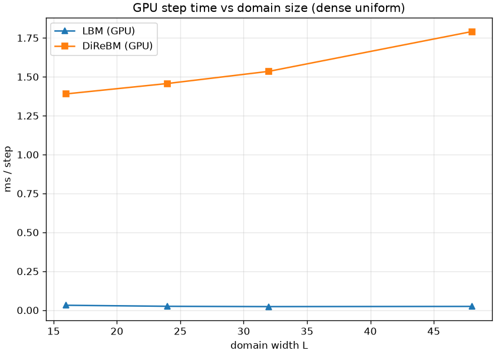

# exp_gpu_bench — GPU-vs-GPU step time: DiReBM vs LBM

Date: 2026-06-26 · Code: `experiments/exp_gpu_bench.py` · GPU: RTX 5080 Laptop (sm_120)

Both solvers on the GPU. For each domain width L: LBM on an L×L grid; DiReBM on a rest field +
central pulse over [-L/2, L/2]². Milliseconds per step (5 steps, after warm-up).

## Result



```
   L  LBM nodes   LBM ms  DRBM mom  DRBM ms
  16        256     0.03      9299     1.39
  24        576     0.03     16453     1.46
  32       1024     0.02     26088     1.54
  48       2304     0.02     50905     1.79
```

- **LBM ~0.02–0.03 ms/step**, flat — a regular grid with trivial kernels; these grids are tiny, so
  the GPU is barely warm (essentially launch overhead).
- **DiReBM ~1.4–1.8 ms/step**, dominated by **fixed overhead**: moments grow 5.5× (9k → 51k) while
  time grows only 1.3×. The floor comes from the irregular pipeline — a radix sort, two HashGrid
  builds, atomic scatter, and a per-step device→host sync (the control-point count) — not from the
  element count.
- On this dense uniform problem **LBM is ~50–90× faster**.

## Reading this honestly

This benchmark is the case **least favourable to DiReBM**: a fully dense, uniform domain with a
fixed grid. LBM is purpose-built for exactly that. DiReBM's reasons to exist —

- adaptive local resolution (more points only where the flow has structure),
- sparse / empty regions tracked for free (cost ∝ active material, not domain volume),
- unbounded domains with no grid,

are **not exercised here**. A fair "DiReBM wins" benchmark would be a localized disturbance in a
large (or unbounded) domain, where LBM must grid the whole box while DiReBM tracks only the active
region. That is future work.

## Optimization opportunities (DiReBM GPU)

The ~1.4 ms floor is overhead, not arithmetic — so it is reducible:

- **Remove the per-step host sync**: `create_control_points` copies the run count to the host to
  size arrays. Keep an upper-bound capacity and stay on-device (indirect launches) to avoid the
  stall.
- **One HashGrid per step**: refine and resampling currently build separate grids; build once over
  control points and reuse.
- **On-device compaction** instead of per-step reallocation; **fuse** small kernels.

> Timing note: these LBM numbers are enqueue-bound (no `wp.synchronize()` in the loop), but the
> grids here are tiny so execution ≈ enqueue. `exp_gpu_locality.md` measures synchronized times for
> the large grids where it matters, and shows the complementary case (DiReBM winning).

## Status

GPU LBM baseline done and validated (`tests/test_warp_lbm.py`: matches CPU HexLBM, rest steady,
mass conserved). The GPU-vs-GPU comparison is honest: DiReBM is overhead-bound on dense uniform
problems; its payoff is sparsity/adaptivity, to be demonstrated next. The user's GPU-port goals
(DiReBM + LBM + fair comparison) are met.
