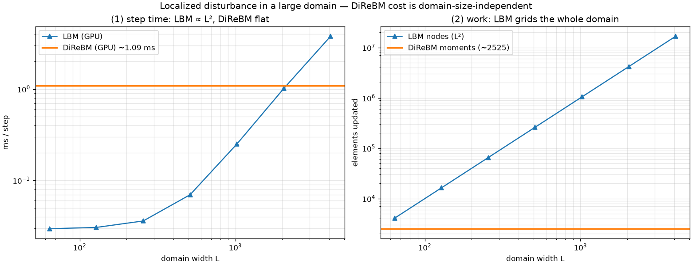

# exp_gpu_locality — where DiReBM beats LBM (large domain, localized flow)

Date: 2026-06-26 · Code: `experiments/exp_gpu_locality.py` · GPU: RTX 5080 Laptop (sm_120)

The complement to `exp_gpu_bench` (which showed LBM winning on small dense domains). Here: a
central pressure pulse on a rest (ρ=1) background, run 8 steps so the disturbance only reaches
radius ~8, over a "domain of interest" of width L ≫ 8.

- **LBM** grids the whole L×L and updates every node every step → cost ∝ L².
- **DiReBM** tracks only the active material; the quiescent far field is implicit rest (the
  resampling gap-fill supplies ρ_rest), so it costs nothing → cost ~constant in L.

Timing is measured with `wp.synchronize()` around the loop (Warp launches are async; the earlier
`exp_gpu_bench` LBM numbers were enqueue-bound — fine there because those grids were tiny).

## Result



```
DiReBM: 1.09 ms/step, 2525 moments  (domain-size independent)

     L  LBM nodes   LBM ms
    64       4096    0.030
   128      16384    0.031
   256      65536    0.036
   512     262144    0.070
  1024    1048576    0.250
  2048    4194304    1.014
  4096   16777216    3.786
```

- **LBM ∝ L²** (panel 1, log-log straight line at large L). **DiReBM is flat** at ~1.1 ms.
- **Crossover at L ≈ 2000.** For larger domains DiReBM is faster: at **L=4096, DiReBM is 3.5×
  faster** (1.09 ms vs 3.79 ms), and the gap widens ∝ L².
- Panel 2: at L=4096 LBM updates **16.7M nodes vs DiReBM's 2525 moments — ~6600× less work** — yet
  DiReBM is only 3.5× faster.

## The overhead floor is the real limiter

DiReBM does ~6600× less work but wins by only 3.5×, because its per-step cost is dominated by a
**fixed overhead floor** (~1.1 ms: radix sort, two HashGrid builds, atomic scatter, a per-step
device→host sync), not by the element count. Consequences:

- The crossover (~L=2000) is set by that floor. **Lowering the overhead moves the crossover left**
  — DiReBM would win on much smaller domains.
- The asymptotic win is capped by the floor, not the work ratio. Removing the floor would let the
  3.5× approach the ~6600× work advantage.

So the structural advantage is real and demonstrated — **DiReBM's cost scales with active material,
not domain volume** — but realizing it broadly depends on the GPU optimizations in
`exp_gpu_bench.md` (drop the host sync, share one HashGrid, on-device compaction, kernel fusion).

## Status

The two benchmarks bracket the trade-off honestly: **LBM wins on small/dense/bounded domains;
DiReBM wins on large domains with localized (sparse) flow**, where its O(active material) cost beats
LBM's O(domain volume). The win is currently overhead-limited → a clear, motivated optimization
target.
