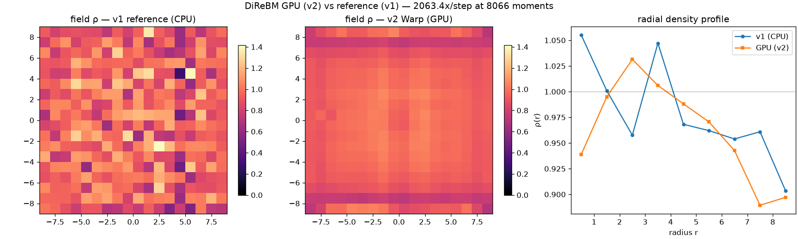

# exp_gpu_vs_v1 — GPU (v2 Warp) vs reference (v1)

Date: 2026-06-26 · Code: `experiments/exp_gpu_vs_v1.py` · GPU: RTX 5080 Laptop (sm_120)

The payoff for the Warp port: does the GPU solver reproduce the v1 reference macroscopically, and
how fast is it? Same init (rest field + central pulse, HALF=8), same parameters (τ=0.6, α=4), 5
steps.

## Result



```
v1 (CPU) :   2937.6 ms/step,  4983 moments
gpu (v2) :      1.4 ms/step,  8066 moments
```

- **Macroscopic agreement**: the radial density profiles overlap within ~0.05 — both sit near rest
  with the expected boundary rarefaction toward the domain edge. The GPU field is in fact
  *smoother* than v1's: cell-thinning produces a more uniform control-point set than v1's greedy
  density threshold, so the reconstruction is less noisy (despite more moments: 8066 vs 4983).
- The GPU solver runs the full irregular pipeline — collision, dispersion, sort-based
  cell-thinning, HashGrid refine, atomic-scatter resampling — in **~1.4 ms/step**.

## On the speedup number

The ~2000× is **versus the v1 reference, which is deliberately unoptimized Python** (built for
clarity and as a correctness oracle, with per-object Python loops). It badly overstates GPU vs a
*good* CPU implementation. The honest takeaways:

- The GPU runs the whole method — including the hard irregular parts (spatial sort, neighbour
  queries, atomic scatter) — in about a millisecond at thousands of moments.
- It processes *more* points than v1 (8066 vs 4983) far faster, so it unlocks scales the reference
  cannot reach. A fair speed number needs a GPU-vs-GPU baseline → the planned GPU LBM port.

## Caveats

Small problem, float32, single run. The GPU solver differs from v1 by design (cell-thinning vs
greedy threshold; soft_outer spawn deferred), so this is macroscopic agreement, not bit-exact.
LBM is still only a proxy for truth (see `exp_lbm_vs_drbm.md`).

## Status

**v2 core complete**: the full DiReBM step runs on the GPU and reproduces the v1 oracle's
macroscopic field. The thesis's open problem — parallelizing this latticeless method — has a
working, validated GPU implementation. Next: GPU LBM baseline for a fair GPU-vs-GPU speed
comparison; then scaling studies and the deferred refinements (soft_outer, adaptive α).
