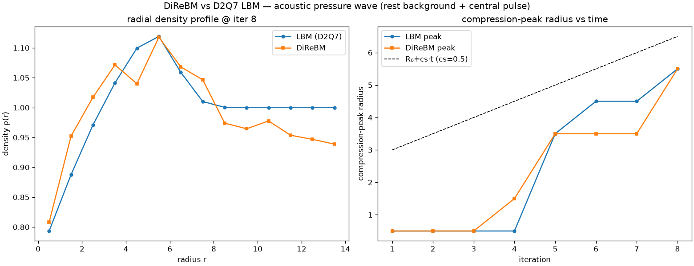

# exp_lbm_vs_drbm — DiReBM vs a D2Q7 LBM baseline (v1)

Date: 2026-06-26 · Code: `experiments/exp_lbm_vs_drbm.py` · Baseline: `direbm.lbm.HexLBM`

This is the thesis's left-as-TODO quantitative comparison (§5.2.2): does DiReBM reproduce the
Lattice-Boltzmann macroscopic behaviour?

## Setup

Identical physics for both (D2Q7, cs²=1/4, τ=0.6) and identical initial condition: a uniform rest
field (ρ=1) with a small central disk (radius 2.5) raised to ρ=1.5. A circular acoustic wave
should radiate. We compare the radial density profile and the compression-peak radius vs time.

- **LBM baseline** (`HexLBM`): D2Q7 on a hexagonal lattice stored in skewed axial coordinates so
  the six directions are integer index shifts → streaming is `np.roll`. Same equilibrium and τ as
  DiReBM, periodic boundaries.
- **DiReBM**: the v1 reference solver on the same rest field + pulse. Macroscopic density
  reconstructed with `bin_fields`.
- Note: unlike `exp_circular_wave` (a single seed in vacuum, whose *ballistic* edge moves at 1
  cell/step), here both sit on a rest background, so we observe the genuine **acoustic** wave.

## Result

- **Radial density profiles overlap** (left): both show the same central rarefaction (ρ≈0.8 at
  the centre), the same **compression peak at r≈5.5 with ρ≈1.12**, and the same return toward
  rest. DiReBM reproduces the LBM wave shape.
- **Compression-peak radius tracks** (right): LBM and DiReBM peaks move together
  (0.5 → 3.5 → 5.5 over 8 steps). DiReBM propagates the pressure wave at the LBM speed — close to
  the lattice sound speed cs=0.5 (both lag the naive R₀+cs·t line by the same amount; what matters
  is that the two methods agree).

**Conclusion:** at the macroscopic level DiReBM matches the D2Q7 LBM acoustic response. Combined
with `exp_rest_state` (rest preserved), the v1 solver is validated for density dynamics.

## Caveats / limits

- DiReBM's field reconstruction is **noisy at ~1–2%** (finite sample points per cell), so a
  threshold-crossing "front" was unreliable; the compression-**peak** radius is the robust metric.
  Noise shrinks as point density grows.
- The finite rest block has a hard edge that disperses into vacuum (boundary rarefaction); the
  front metric is windowed to the interior to avoid it. A periodic / padded DiReBM boundary would
  be cleaner.
- Single run, one parameter set, 1-cell radial bins. A convergence study (vs α, vs pulse width,
  and a quantitative sound-speed fit) is the natural follow-up.

## Status

Quantitative DiReBM-vs-LBM comparison established and positive. v1 reference solver trusted for
density + acoustics. Next: convergence/parameter study, then begin the Warp (v2) GPU port against
this oracle.
