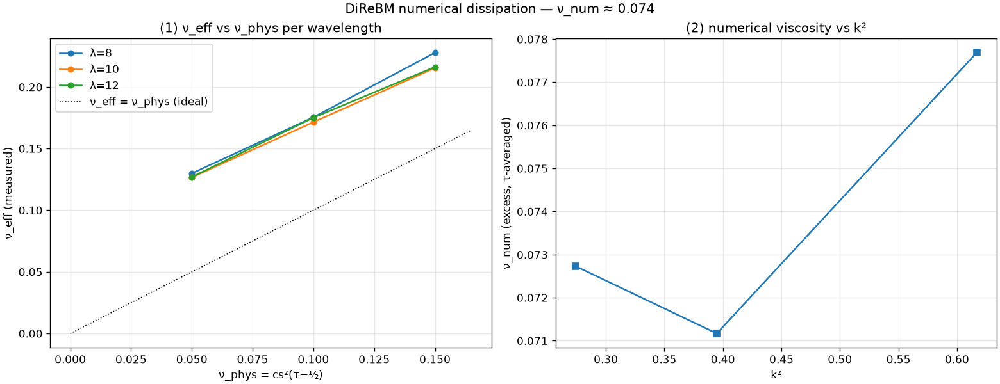

# exp_numerical_viscosity — pinning DiReBM's numerical dissipation

Date: 2026-06-28 · Code: `experiments/exp_numerical_viscosity.py` · Solver: `direbm.reference.Simulator`

`exp_taylor_green` found DiReBM over-dissipative. Here we pin it: sweep τ and wavelength, measure
the Taylor–Green decay rate λ for each, and extract the effective and numerical viscosities

    ν_eff = λ / (2 k²),    ν_num = ν_eff − ν_phys,    ν_phys = cs²(τ − ½),  cs² = 1/4.

## Result



```
 tau  nu_phys  wavelen   nu_eff   nu_num   ratio
 0.7   0.0500     8.0    0.1299   0.0799   2.60
 0.7   0.0500    10.0    0.1266   0.0766   2.53
 0.7   0.0500    12.0    0.1270   0.0770   2.54
 0.9   0.1000     8.0    0.1754   0.0754   1.75
 0.9   0.1000    10.0    0.1715   0.0715   1.71
 0.9   0.1000    12.0    0.1751   0.0751   1.75
 1.1   0.1500     8.0    0.2278   0.0778   1.52
 1.1   0.1500    10.0    0.2154   0.0654   1.44
 1.1   0.1500    12.0    0.2162   0.0662   1.44

nu_num: mean = 0.0739, std = 0.0048
```

- **DiReBM's numerical viscosity is a fixed additive constant: ν_num ≈ 0.074** (±0.005, ~6%),
  essentially **independent of both τ and wavelength**. Panel 1 shows ν_eff vs ν_phys is slope-1,
  offset up by ~0.074, for every wavelength; panel 2 shows ν_num flat in k².
- So `ν_eff = ν_phys + 0.074`. The "1.65× too fast" from `exp_taylor_green` was just the ratio at
  ν_phys = 0.1; the *ratio* varies (2.6× at ν_phys=0.05 → 1.44× at ν_phys=0.15), but the **additive
  excess is the invariant**.
- k-independence means it is a genuine (∝k²) diffusion with a fixed coefficient, not a hyperviscosity
  — consistent with a fixed real-space smoothing of width ~√(2·0.074) ≈ 0.38·dx per step from the
  dispersion/resampling.

## Consequences

- **Minimum achievable viscosity ≈ 0.074** (lattice units, dx=dt=1). DiReBM cannot simulate a fluid
  less viscous than this without reducing its numerical diffusion → a ceiling on the achievable
  Reynolds number at a given resolution. Reducing it requires cutting the over-sampling/resampling
  smoothing (the adaptive-resolution direction).
- **Compensation rule** for a target physical viscosity ν_target ≳ 0.074:

      τ = ½ + (ν_target − 0.074) / cs²  =  ½ + 4 (ν_target − 0.074)

  **Validated:** target ν = 0.15 → τ = 0.804 → measured ν_eff = **0.154** (~2%). The rule lands the
  effective viscosity on target.

## Caveats

~6% scatter; a weak hint of a rise at the shortest wavelength (k²≈0.62). Single domain (L=10),
single amplitude (U=0.1, low Mach), reference solver. A finer/wider sweep would tighten ν_num and
test its mild k-trend, but the additive-constant picture is clear.

## Status

DiReBM's over-dissipation is pinned: **a fixed numerical viscosity ν_num ≈ 0.074**, additive to the
BGK viscosity and ~independent of τ and k. Gives a compensation rule and a hard minimum-viscosity
floor — a precise, quantitative method characterization (the analytic GT made it measurable).
