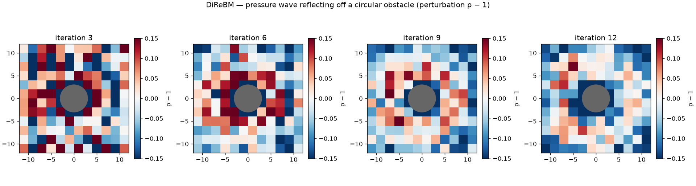

# exp_obstacle — pressure wave reflecting off a circular obstacle (v1)

Date: 2026-06-27 · Code: `experiments/exp_obstacle.py` · Solver: `direbm.reference.Simulator`

Demonstrates DiReBM's headline claimed advantage over LBM: **arbitrary surfaces are easy.** A
surface only needs `inside(p)` and `ray_hit(x0, x1)` — no lattice-aligned staircasing. Here a solid
disc (radius 3) sits in rest fluid; a pulse offset to the left radiates and strikes it.

## Method (thesis §4.5)

During dispersion, a component whose step would enter the solid is **reflected specularly** about
the surface normal. The reflected direction is generally not one of the seven c_i, so it is **split
into the two adjacent lattice directions** with linear-interpolation weights — conserving the
component's mass. A final cleanup drops any moment that ended up inside the solid. (See
`direbm/reference/boundary.py`; geometry unit-tested in `tests/test_boundary.py`.)

## Result

Perturbation ρ − 1 (compression red, rarefaction blue), binned at h=2 to reduce reconstruction
noise; the grey disc is the solid.

- The **solid is respected** — no fluid penetrates it (the bounce + cleanup keep it empty).
- **Compression builds on the impact (left) side** as the wave hits the obstacle (iter 6), with a
  **shadow** of weaker perturbation behind it (right) — the expected reflection + obstruction.

## Caveats

- DiReBM's per-cell field reconstruction is noisy (~1–2%); the acoustic perturbation is the same
  order, so the picture is qualitative. (Same limitation as the other reference experiments.)
- Simplifications in this first implementation: penetration is detected by the **step endpoint**
  being inside (no tunnelling — fine when the obstacle ≫ dx); the split assumes the reflected
  lattice directions land outside (true for a convex obstacle with fluid outside), with a
  keep-at-origin fallback otherwise. Bounce is **specular** (free-slip), not no-slip.
- v1 reference only. A GPU (v2) port of boundary handling is future work.

## Status

Boundary handling works in the reference solver: arbitrary surfaces via `inside`/`ray_hit`,
mass-conserving specular bounce with direction-split, fluid kept out of the solid. Showcases the
method's claimed strength over LBM (off-axis surfaces without staircasing).
