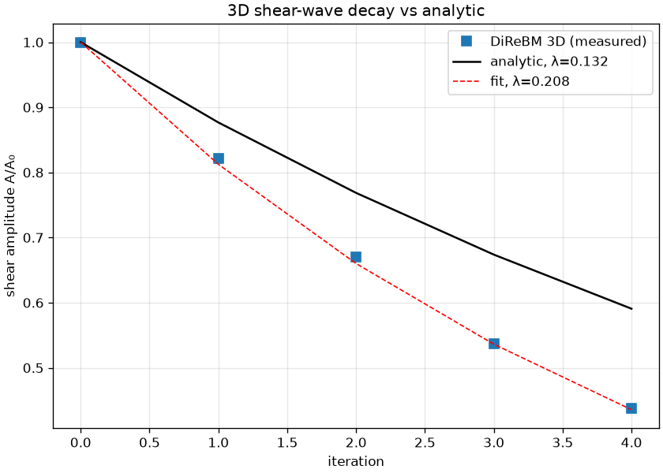

# exp_shear_3d — 3D quantitative validation (analytic ground truth)

Date: 2026-06-29 · Code: `experiments/exp_shear_3d.py` · Solver: `direbm.reference.Simulator` (D3Q13)

The 3D analog of `exp_taylor_green`. A single-mode shear wave `u_x = U cos(kz)` (u_y=u_z=0) is an
exact eigenmode of linearized incompressible Navier–Stokes and decays as e^{-λt} with the
**analytic** rate **λ = ν k²** (one wavenumber, |K|²=k²). We initialize it on D3Q13, project the
measured velocity onto the shear pattern, and compare. cs² = 1/5, τ = 1.1 → ν_phys = 0.12,
k = 2π/6 → analytic λ = 0.132/step.

## Result



```
 iter    #mom    A/A0
    1    2695   0.8210
    2    9126   0.6698
    3   21288   0.5373
    4   34616   0.4376
measured λ = 0.208  →  ν_eff = 0.189,  ν_num = 0.069   (ratio ν_eff/ν_phys = 1.58)
```

- **3D viscous physics is correct in form:** clean exponential shear-wave decay (the fit tracks the
  points). DiReBM does genuine 3D viscous dynamics.
- **Over-dissipative ~1.58×** (measured λ=0.208 vs analytic 0.132) — same story as 2D.
- **3D numerical viscosity ν_num ≈ 0.069 ≈ the 2D value (~0.074).** The numerical dissipation from
  dispersion/resampling is **dimension-robust at ~0.07** — not an artifact of the 2D geometry.

## Caveats

Small 3D domain (7³ = 343 moments) — 3D over-sampling is severe (the count inflates to ~35k in 4
steps, so runs are slow), giving only ~4 steps and a probe restricted to |x|,|y|<1.5 (the shear is
uniform in x,y; this avoids the x,y edges). The first step carries an init transient. So ν_num_3d
has ~15% uncertainty — but the match to the 2D value is clear.

## Status

3D is **quantitatively validated** against an analytic ground truth: DiReBM-3D reproduces the
viscous decay form, and its numerical viscosity (~0.069) matches the 2D value — the over-dissipation
is a dimension-independent ~0.07 property of the method, traceable to the over-sampling/resampling
smoothing (the lever to reduce it is adaptive resolution, as in 2D).
