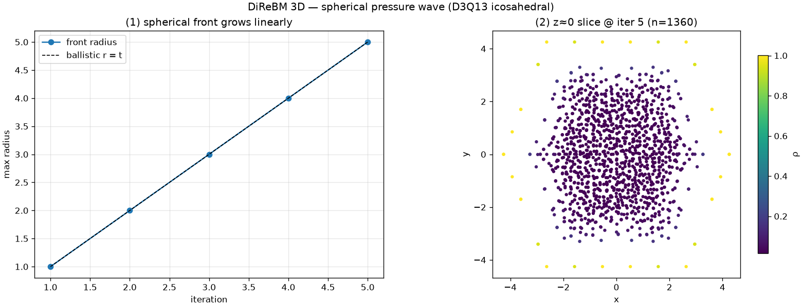

# exp_sphere — spherical pressure wave in 3D

Date: 2026-06-28 · Code: `experiments/exp_sphere.py` · Solver: `direbm.reference.Simulator` (D3Q13)

The 3D analog of `exp_circular_wave`: a point pulse in 3D rest fluid radiates a spherical wave on
the **D3Q13 icosahedral** lattice (ADR 0002). Demonstrates the runnable 3D reference solver.

## Result



```
 iter  #moments   max_r
    1        13    1.00
    2        85    2.00
    3       451    3.00
    4      1753    4.00
    5      4262    5.00
```

- **Front radius = iteration exactly** (panel 1, on the ballistic r=t line) — isotropic spherical
  spread, unit dispersion per step, as in 2D.
- The **z≈0 slice** (panel 2) is a roughly circular cross-section of the sphere, with the bright
  (high-ρ) compression front on the rim — the equatorial cut of a spherical wave.
- Moment count grows steeply (13 → 4262) — 3D over-sampling is heavier than 2D (a dx/α cell in 3D
  holds more control points), so 3D runs are slower; the same over-sampling theme as 2D.

## Caveats

Per-moment ρ is diluted (1/point-density), as in 2D — the macroscopic field would come from 3D
binning (`bin_fields` is 2D-only so far). Qualitative demo of isotropic 3D propagation; quantitative
3D validation (e.g. spherical-wave speed, or 3D Taylor–Green) is the next 3D step. soft_mode="off"
(the hex spawn is 2D-only).

## Status

The reference solver runs in 3D end-to-end on D3Q13 (collision + the four propagation sub-steps,
dimension-generic grid + simulator). A spherical pulse propagates isotropically. Validated by
`tests/test_reference_3d.py` (spread + rest-density preservation).
