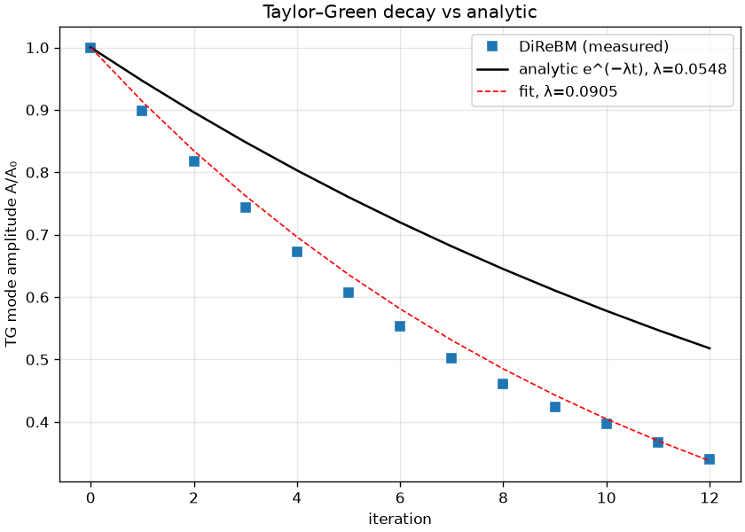

# exp_taylor_green — validation against an analytic ground truth

Date: 2026-06-27 · Code: `experiments/exp_taylor_green.py` · Solver: `direbm.reference.Simulator`

The 2D **Taylor–Green vortex** is an exact decaying solution of incompressible Navier–Stokes:

    u_x = -U cos(kx) sin(ky) e^{-λt},   u_y = U sin(kx) cos(ky) e^{-λt},   λ = 2 ν k².

Its mode amplitude decays at the **analytic** rate λ = 2νk² — a real ground truth, not the LBM
proxy used elsewhere (addresses the caveat in `exp_lbm_vs_drbm.md`). We initialize the field,
project the measured per-moment velocity onto the TG pattern each step (incoherent reconstruction
noise averages out), and compare the decay rate. ν = cs²(τ − 1/2) = (1/4)(0.9 − 0.5) = 0.1,
k = 2π/12, so **analytic λ = 0.0548 / step**.

## Result



```
 iter   A/A0
    0   1.0000
    2   0.8172
    4   0.6727
    6   0.5531
    8   0.4612
   10   0.3975
   12   0.3398
measured λ = 0.0905 / step   (analytic 0.0548;  ratio 1.65)
```

- **Right form:** the TG mode decays as a clean exponential (the fit tracks the points) — DiReBM
  does genuine viscous fluid dynamics, not just acoustics.
- **Over-dissipative:** the decay is **~1.65× faster than analytic** — DiReBM's effective viscosity
  is ≈ 1.65× the physical ν.
- **It is numerical dissipation, not a boundary artifact.** Repeating with a larger domain
  (`TG_L=18`, less edge leakage) gave ratio **1.72** — slightly *higher*, not lower. If the excess
  were boundary leakage, the larger domain would have decayed *slower*. So the excess is intrinsic.

## Interpretation

DiReBM's dispersion (spreading each moment into components) and resampling (distance-weighted
scatter + cell-thinning centroid + rest-fill) all **smooth the field** — adding numerical diffusion
on top of the BGK viscosity. The result: ~70% excess effective viscosity. This is exactly what an
analytic GT reveals and the LBM comparison could not (acoustics matched LBM qualitatively, but both
share discretization error; the TG rate is unforgiving).

This ties to the **over-sampling / dilution** theme: the same resampling machinery that dilutes
per-moment density also diffuses momentum. Reducing over-sampling (the adaptive-resolution
direction) would likely also cut the numerical viscosity.

Practical consequence: to hit a target physical ν, one must **compensate** (lower τ toward 1/2 so
the BGK ν plus the ~0.65·ν numerical part sum to the target), or reduce the numerical diffusion.

## Caveats

Per-moment velocity reconstruction; mode projection is noise-robust but the absolute rate carries
~10% uncertainty (the initial step shows an extra transient as the imposed field settles into the
representation). Single parameter set (one k, one τ); a sweep would map ν_eff(τ, k) and confirm the
~1.65× factor's stability.

## Status

First **analytic-ground-truth** validation. DiReBM reproduces the Taylor–Green decay *form* exactly
but with ~1.65–1.72× the physical viscosity — a quantified numerical-dissipation limitation
(confirmed intrinsic, not a boundary effect) that the thesis never measured.
